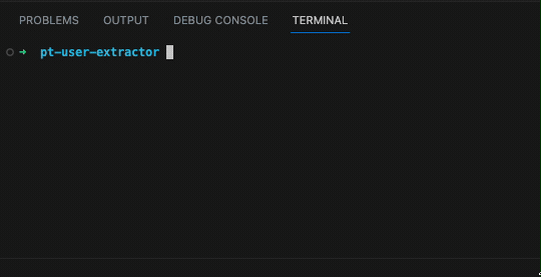

# Instructions

Please create some PHP code in a memory restricted environment to retrieve fictional user data from a database and anonymize the email address. Please consider the use of SOLID.

## Final result

  

## Requirements

1. PHP v7.4 or higher
1. `pdo_sqlite` extension (Run `php -m | grep sqlite` to find out if you have it)

## Getting started

**Migrate**
    
    php cli.php migrate

**Seed**

    php cli.php seed

**Get users**

    php cli.php get-users

## Note from author

Apologies for the lack of PSR formatting in some places.
